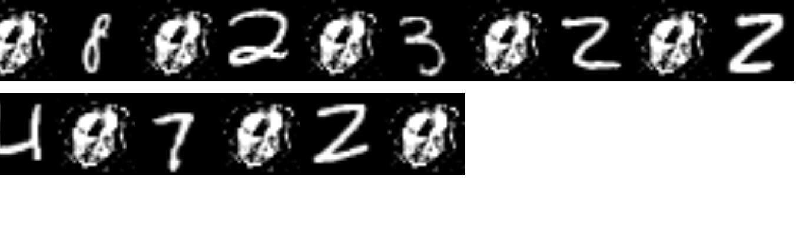

# about

this repo is the beginning of a Variational Autoencoder (VAE), or generative abstract imaginary awesomenss (GAIA), plus other js ML goodies, like functional modeling using tensorflow-core.  

But rn it;s brokne :^3 

Our original VAE results were awful, so we went back to "sanity check" and just see if our dense layers could replicate the results of a regular autoencoder, as seen in this [stackexchange](https://stats.stackexchange.com/questions/190148/building-an-autoencoder-in-tensorflow-to-surpass-pca#answer-307746)

Those results are also awful, and that is the current status;  sanity remains in check; see `app.js` 

the image at the top shows actual digits next to reconstructed digits, after 6 epochas over 20K mnist images; the loss is usually between .2 and .5;  I feel like it's getting worse every attempt!

# run app.js
there is a bundled app in the `/public` folder you can serve as a static dir and open /index.html; or use the simple build step below;  currently it logs the loss periodically to the dev console (ctrl-shift-j), and after the epochas finish it reconstructs a small test batch, and appends those as canvas to the page next to the original.

# build

git clone && npm i

you can use something like [budo](https://npmjs.com/package/budo) to build `app.js`

`npm i -g budo`
`budo app.js --dir /public`
 
currently it writes the  

# problems

with lots of training that takes a long time, the results have been all over the place
